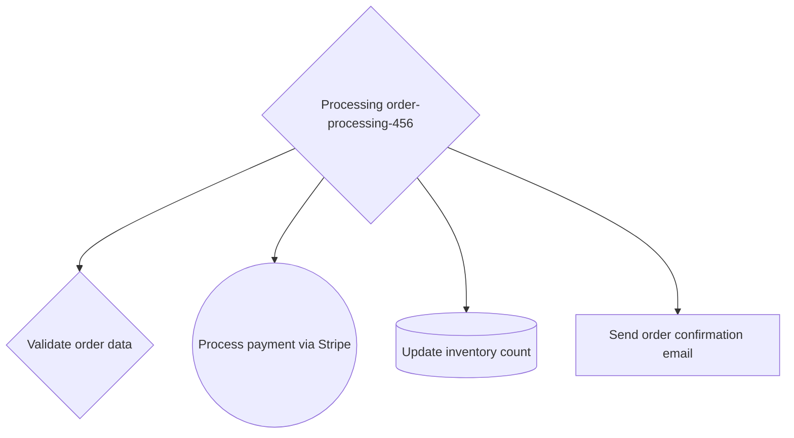

# Decision Trail

Track and audit decision trees in your applications with structured logging and visualization support.

## Features

- 🌳 **Structured Decision Tracking** - Build hierarchical decision trees with clear parent-child relationships
- ⚡ **Performance Monitoring** - Automatic timing of operations with duration tracking
- 🔍 **Rich Metadata** - Capture context, inputs, outputs, and custom metadata for each decision
- 🌐 **API Call Tracking** - Specialized support for tracking external API calls and database queries
- 📊 **Visualization** - Export to Mermaid flowcharts and pretty-print decision trees
- 🛠️ **TypeScript Support** - Full type safety with comprehensive TypeScript definitions

## Installation

```bash
npm install decision-trail
```

## Quick Start

```typescript
import { DecisionTrail } from 'decision-trail';

// Create a new decision trail for a process
const trail = new DecisionTrail('order-123', {
  version: '1.0.0',
  environment: 'production'
});

// Track a condition evaluation
const isValid = trail.evaluateCondition(
  'Validate order amount',
  () => order.amount > 0,
  { amount: order.amount }
);

// Track an API call
const result = await trail.trackApiCall(
  'Process payment',
  () => paymentService.charge(order.amount),
  '/api/payments/charge'
);


// Finalize and get the complete trace
const trace = trail.finalize('completed');
console.log(trail.toJSON());
```

## API Reference

### DecisionTrail

The main class for tracking decision trees.

#### Constructor

```typescript
new DecisionTrail(processId: string, config: DecisionTrailConfig)
```

- `processId` - Unique identifier for the process being tracked
- `config` - Configuration object with version, environment, and optional metadata

#### Core Methods

##### `addDecision(type, description, inputs?, metadata?)`
Add a new decision node and return a new trail instance for chaining.

##### `setResult(result, metadata?)`
Set the result of the current decision node.

##### `trackAsync(type, description, operation, inputs?, metadata?)`
Track an async operation with automatic error handling and timing.

##### `trackSync(type, description, operation, inputs?, metadata?)`
Track a synchronous operation with automatic error handling and timing.

#### Specialized Tracking Methods

##### `trackApiCall(description, apiCall, endpoint?)`
Track external API calls with endpoint metadata.

##### `evaluateCondition(description, condition, inputs?)`
Track boolean condition evaluations.

##### `trackDbQuery(description, query, queryInfo?)`
Track database queries with table and operation metadata.

##### `trackFileOperation(description, operation, filePath?)`
Track file system operations.

##### `trackServiceCall(serviceName, description, serviceCall, endpoint?)`
Track calls to external services.


#### Utility Methods

##### `finalize(finalState)`
Complete the trace and set the final state.

##### `getTrace()`
Get a copy of the current trace.

##### `toJSON()`
Serialize the trace to JSON string.

##### `fromJSON(json)` (static)
Deserialize a trace from JSON string.

### Types

#### DecisionNode
```typescript
interface DecisionNode {
  id: string;
  type: "condition" | "action" | "api_call" | "data_lookup" | "rule_evaluation" | "custom";
  description: string;
  timestamp: Date;
  inputs: Record<string, any>;
  result?: any;
  children: DecisionNode[];
  metadata?: {
    duration_ms?: number;
    api_endpoint?: string;
    error?: string;
    rule_name?: string;
    service?: string;
    [key: string]: any;
  };
}
```

#### DecisionTrace
```typescript
interface DecisionTrace {
  processId: string;
  startTime: Date;
  endTime?: Date;
  finalState?: string;
  rootDecision: DecisionNode;
  metadata: {
    version: string;
    environment: string;
    user?: string;
    [key: string]: any;
  };
}
```

## Visualization

The library includes utilities for visualizing decision trees:

```typescript
import { printDecisionTree, toMermaidFlowchart } from 'decision-trail';

const trace = trail.finalize('completed');

// Pretty-print the decision tree
console.log(printDecisionTree(trace.rootDecision));

// Generate Mermaid flowchart
const mermaidCode = toMermaidFlowchart(trace.rootDecision);
```

### Example Mermaid Chart

For an order processing workflow, the generated Mermaid chart would look like:



Different node types are represented with different shapes:
- **Conditions** (blue): Diamond shapes `{}`
- **API Calls** (orange): Double circles `(())`
- **Data Lookups** (orange): Stadium shapes `[()]`
- **Actions** (green): Rectangle shapes `[]`

## Use Cases

- **Audit Trails** - Track decision-making processes for compliance and debugging
- **Performance Analysis** - Identify slow operations in complex business logic
- **Error Tracking** - Capture the full context when failures occur
- **Business Intelligence** - Analyze decision patterns and outcomes
- **Debugging** - Understand the flow of complex conditional logic
- **Process Documentation** - Auto-generate documentation of business processes

## Development

```bash
# Install dependencies
npm install

# Run tests
npm test

# Build the project
npm run build

# Run tests with coverage
npm run test:coverage
```

## License

MIT

## Requirements

- Node.js >= 16.0.0
- TypeScript support included